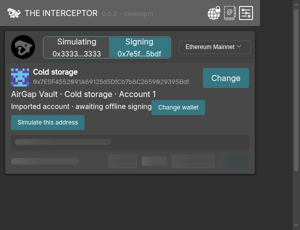
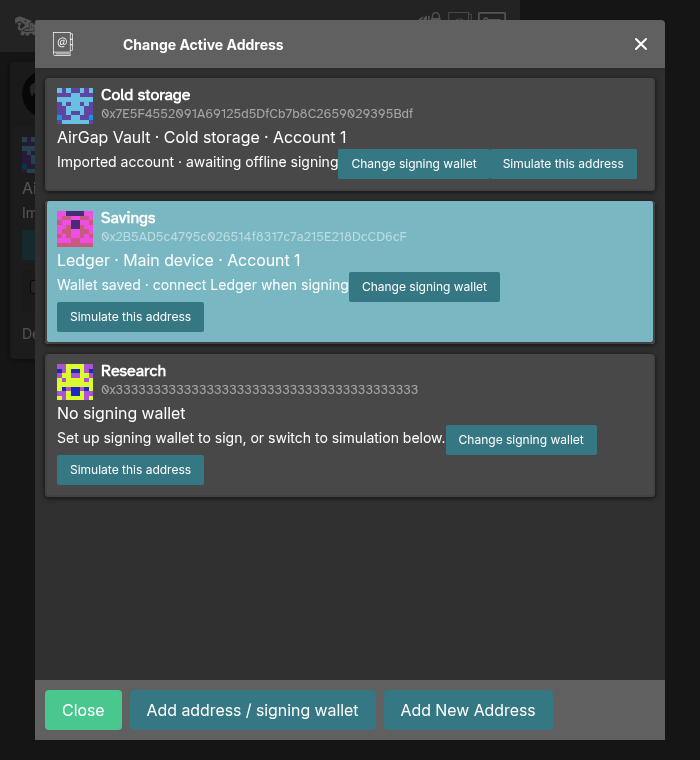
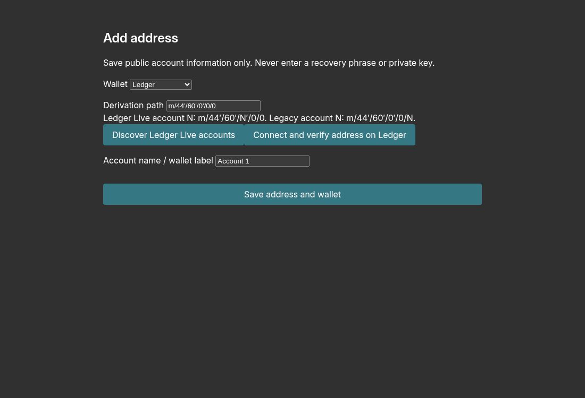
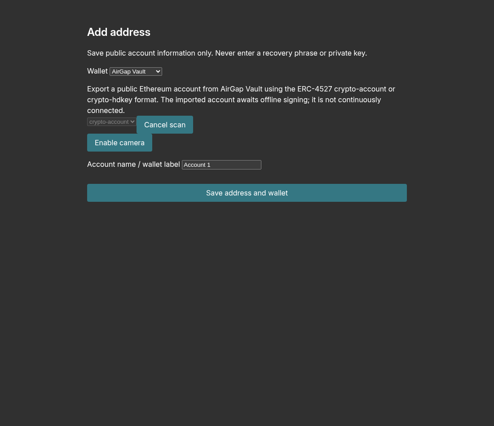
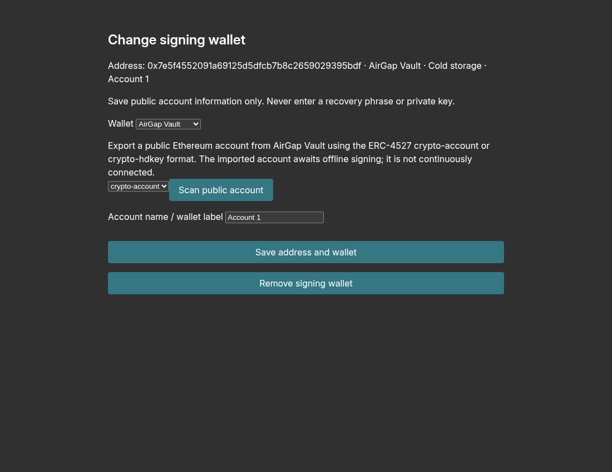
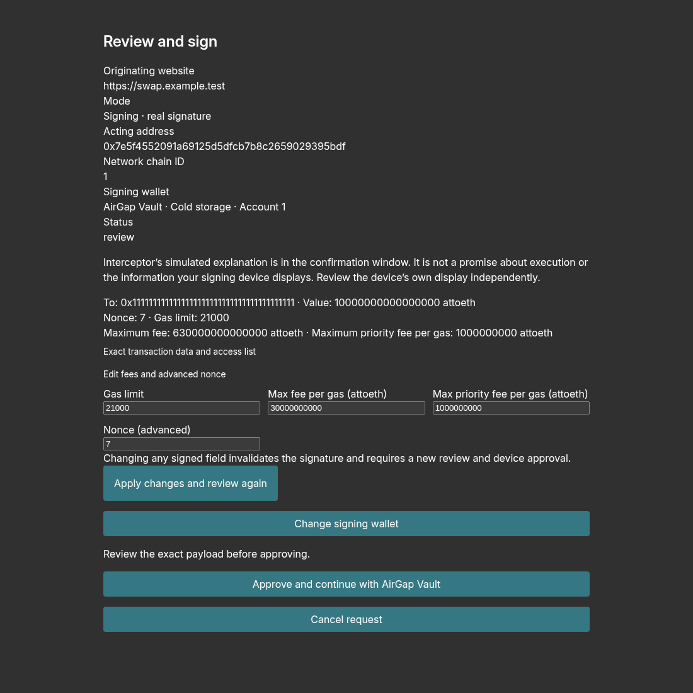
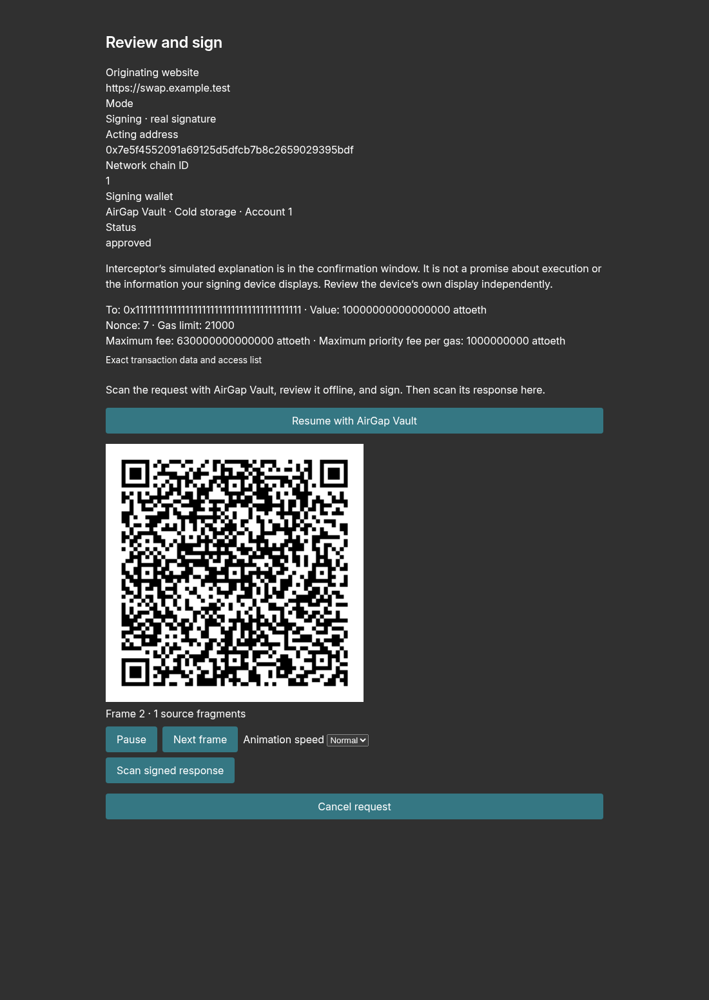
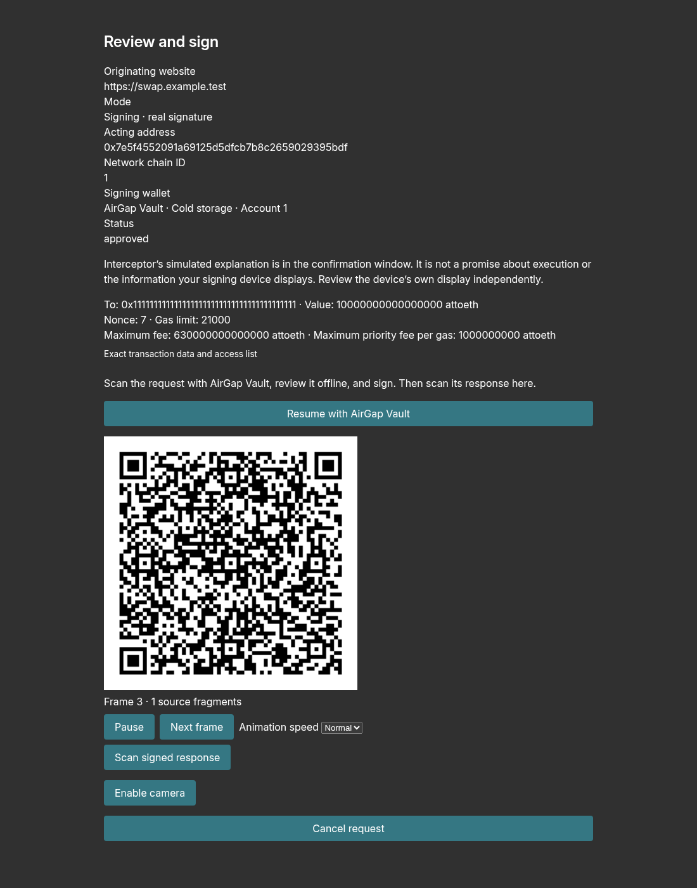
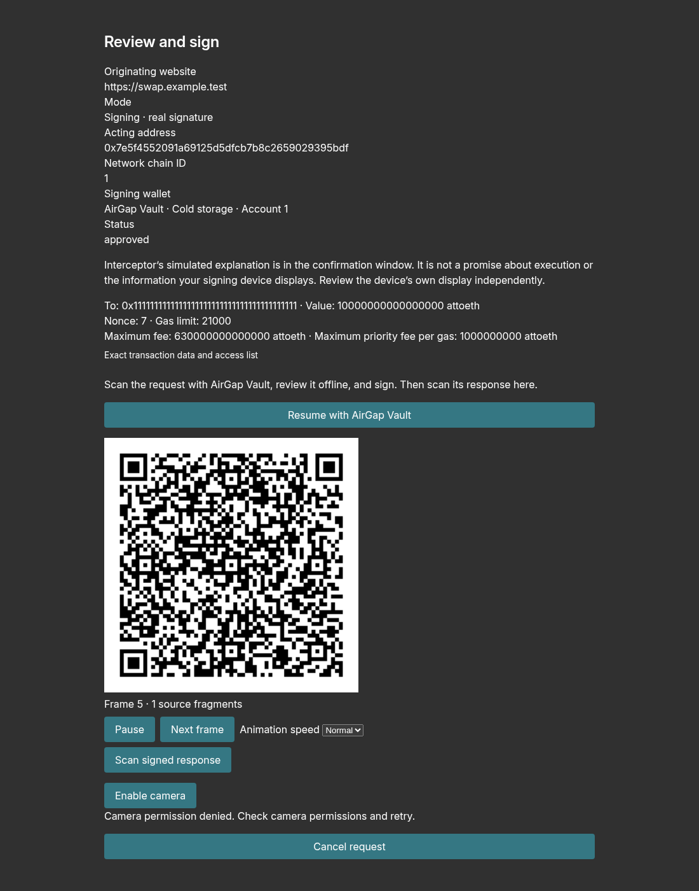
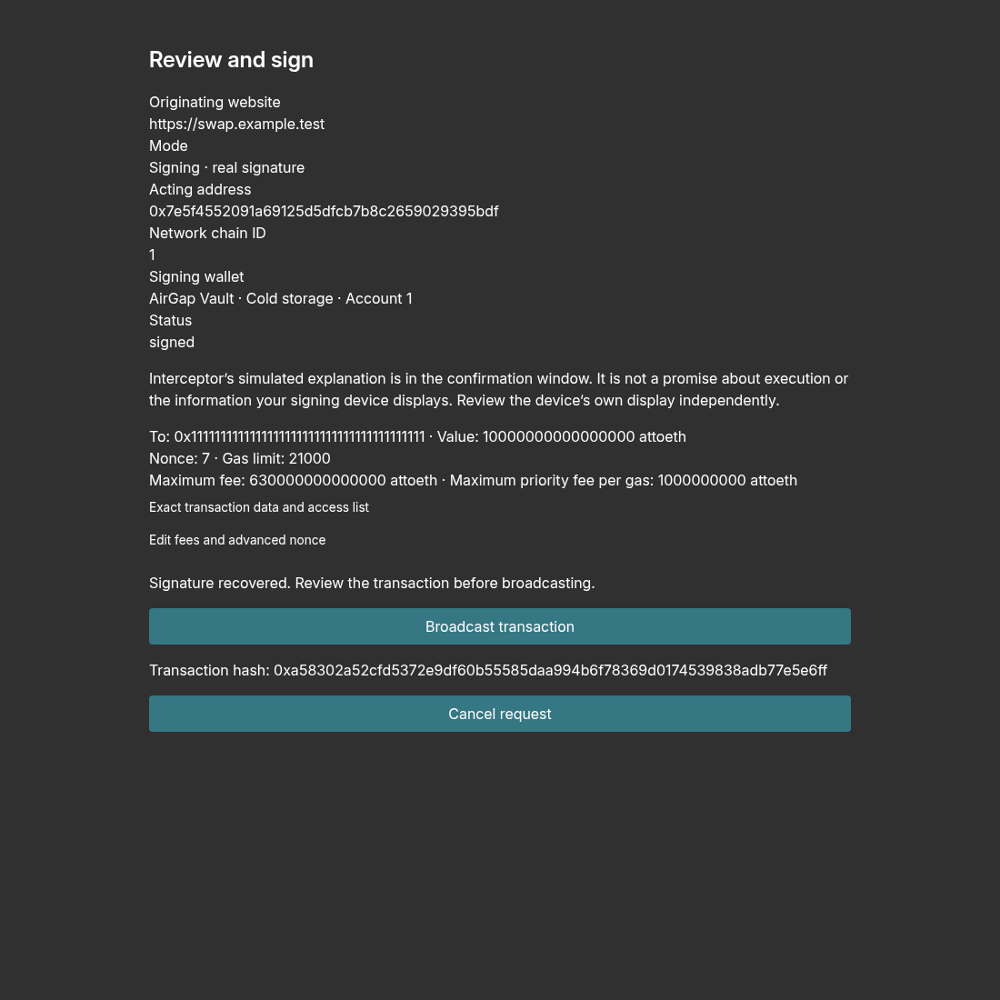

# Direct signing UI walkthrough

These are screenshots of the built Chrome extension using isolated fixture storage and public test accounts. They illustrate the interface, not physical Ledger/Vault interoperability or live-chain execution. Approval and signed states were seeded; the camera-denial example was mocked. No transaction was broadcast.

## 1. Home: address, wallet, and mode

Opening Home with the saved Cold storage fixture shows its AirGap account beneath the address. The mode buttons show different remembered addresses. Use Change to select an address, Change wallet to edit its binding, or Simulate this address for simulation. The chain-data area is still loading in this capture.

## 2. Choose an address without connecting hardware

Clicking Change opens the address selector. The fixtures show an imported AirGap account, a saved disconnected Ledger account, and a manual address without a wallet. Select a row to use that address; its Change signing wallet action edits the binding without selecting the row.

## 3. Add a Ledger account

Add address / signing wallet opens the dedicated onboarding page. Choose Ledger, then discover accounts or enter a derivation path. The next steps require connecting a device and verifying the selected address on-device before saving; no physical Ledger was used for this capture.

## 4. Import an AirGap public account

Selecting AirGap Vault and Scan public account reveals camera controls. Enable camera to scan the public-account export, then review and name the imported account before saving. This screenshot stops before camera permission or an actual Vault scan.

## 5. Edit an existing address’s wallet

Change wallet opens setup restricted to the existing Cold storage fixture address. A replacement must match that address. Remove signing wallet retains the address. This saved binding was seeded for the walkthrough, not created by the preceding camera scan.

## 6. Review exact transaction fields

The dedicated signing page shows the originating website, mode, account, chain, wallet, and final transaction fields. Opening Edit fees and advanced nonce exposes the editable fields. Apply changes and review again refreshes approval; Approve and continue starts the selected signing workflow.

## 7. Take the request to AirGap Vault

Resuming the fixture request in its approved state generates an animated UR signing request. Scan it with Vault, review and sign offline, then choose Scan signed response. Pause, Next frame, and animation speed control presentation. The approved state was seeded; no Vault signed this request.

## 8. Scan the offline signature

Scan signed response exposes Enable camera. After permission, the scanner collects the returned signature fragments for independent account and payload verification. This capture shows the step before camera access, not a successful physical-camera round trip.

## 9. Recover from denied camera permission

Clicking Enable camera with a mocked permission denial shows the error and retry guidance. Correct camera permissions and try Enable camera again, or cancel the request. The denial was injected to demonstrate this recovery state.

## 10. Explicitly broadcast a signed transaction

A seeded signed fixture shows the transaction hash and Broadcast transaction action. In normal use this follows successful signature verification. Review the fields before broadcasting; editing them requires a new review and signature. This example uses a known public test key and was never broadcast.

