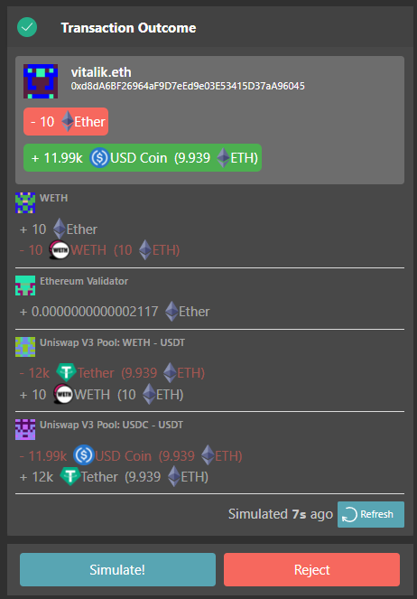
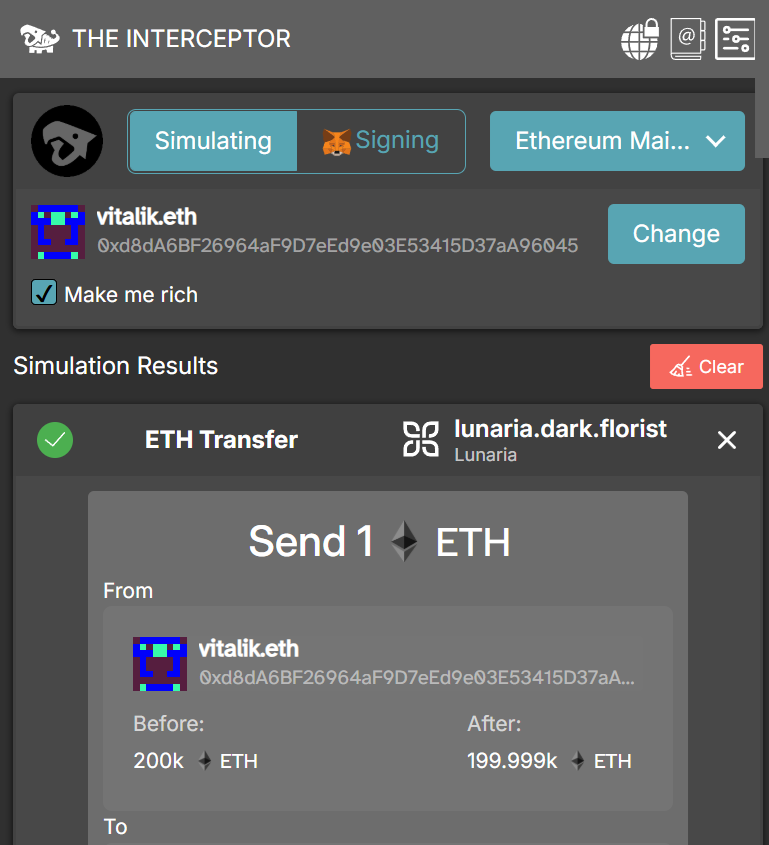

# The Interceptor
The Interceptor is a powerful tool for simulating transactions on EVM-based chains, including Ethereum Mainnet, Base, Optimism, Gnosis, and more. It offers clear, intuitive explanations for the transactions you initiate. The Interceptor can seamlessly complement your browser wallet, like MetaMask, or function as a standalone transaction simulation tool.

With MetaMask integration, you can forward transactions for signing and send them effortlessly. What truly sets The Interceptor apart, however, is its Simulation Mode. This feature lets you simulate multiple transactions sequentially, providing a detailed preview of their outcomes-even enabling you to interact with DApps at no cost!

Install for [Firefox](https://github.com/DarkFlorist/TheInterceptor/releases/download/v0.0.25/TheInterceptor-firefox-v0.0.25.xpi) or [Chrome](https://www.dark.florist/google-chrome-install)

## Features
- Simulation mode, send transactions for free and see what they do
- Impersonation mode, be Vitalik or anyone else and see the dApps with the eyes of anyone
- Rich mode, browse dapps with extra 200 000 ETH in your pocket!
- Simulate your transactions before sending them to be sure on what they do
- Avoid common token pitfalls such as sending tokens to tokens contract address
- Rescue assets with The Interceptor and [Bouquet](https://bouquet.dark.florist/)
- And more!

## Privacy
Your privacy is our priority. The Interceptor is purpose-built to minimize data leakage: no external queries are made without direct user input except for calls to the configured Ethereum RPC server. By default, it connects to Ethereum RPC nodes operated by [Dark Florist (us)](https://www.dark.florist/) which doesn't log requests, though you can configure it to connect to other RPC nodes if desired. Please note, The Interceptor requires RPC nodes that support the `eth_simulateV1` endpoint, currently available in Geth and Nethermind.

## Using The Interceptor on various EVM chains
We are not currently operating nodes for Base, Optimism etc, in order to use these chains you will need to add your own RPC.

## Good tools to use with The Interceptor
The Interceptor requires websites to be decentralized and only use users' own wallet to access the network. The following tools are tested to work on The Interceptor:
- [Lunaria](https://lunaria.dark.florist/)
- [NFT sender](https://nftsender.dark.florist/)
- [Horswap 2](https://2.horswap.eth.limo/)
- [Bouquet](https://bouquet.dark.florist/)

# Development

## Setup

Install:
`npm ci --ignore-scripts`

Build:
`npm run setup-chrome` for Chrome or `npm run setup-firefox` for firefox

Then depending on your browser:
- Chrome: Browse to `chrome://extensions/` and click `Load unpacked` and point to `\app\manifest.json`.
- Firefox: Browse to `about:debugging` and click `Load Temporary Add-on` and point to `\app\manifest.json`.
- Brave: Browse to `brave://extensions/` and click `Load unpacked` and point to `\app\manifest.json`.

# Contact Us!
You can reach us [Dark Florist](https://www.dark.florist/) via [Discord](https://discord.gg/b66SwRZAbu) and twitter [@DarkFlorist](https://twitter.com/DarkFlorist)!
