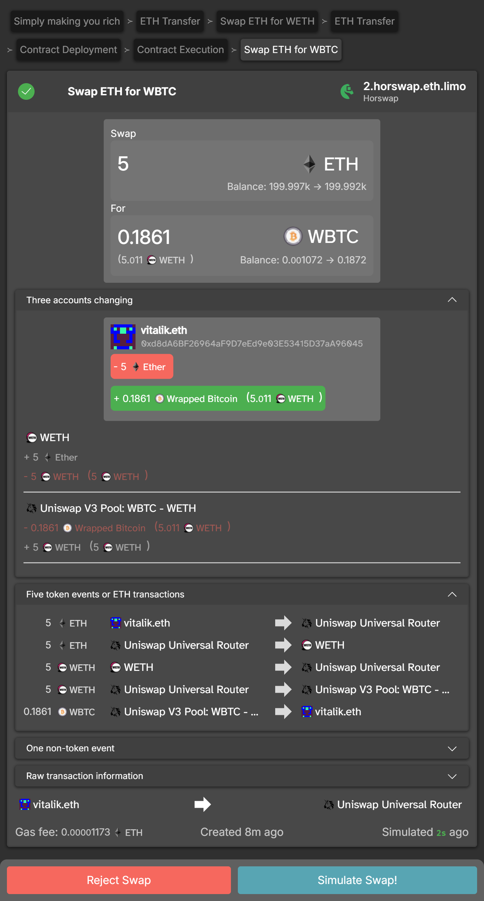

# The Interceptor Alpha
Introducing The Interceptor - the ultimate browser extension for Ethereum! Say goodbye to the confusion of making transactions with our intuitive tool that provides clear explanations of the type of Ethereum transactions you're making. The Interceptor can be used alongside with Metamask or as a standalone transaction simulation tool. With Metamask integration, you can easily send transactions by forwarding them for signing. But what really sets The Interceptor apart is its Simulation Mode. This powerful feature allows you to simulate multiple transactions and see exactly what they will do - even using DApps for free! Our extension is currently available on Chrome, Firefox, and Brave, and supports Ethereum Mainnet, Sepolia and Görli networks. Experience seamless Ethereum transactions like never before with The Interceptor.

# Privacy
We value your privacy highly. The Interceptor is designed to minimize privacy leakage: We don't query external sites for anything. However, The Interceptor Alpha is currently connecting to Ethereum RPC nodes operated by Dark Florists (us) because we utilize some custom tooling on the backend. Work is underway to get our custom tooling standardized across clients so Interceptor will work with any standards compliant Ethereum client.

# Installation
Download [The Interceptor](https://github.com/DarkFlorist/TheInterceptor/releases/latest) and depending on your browser:

- Chrome: Unzip The interceptor-chrome zip to a folder, browse to `chrome://extensions/` and click `Load unpacked` and select the folder.
- Firefox: Browse to `about:debugging` and click `Load Temporary Add-on` and select the interceptor-firefox zip. You need to re-add the extension every time you restart Firefox.
- Brave: Unzip The interceptor-chrome zip to a folder, browse to `brave://extensions/` and click `Load unpacked` and select the folder.

Next you should click your extensions from the top right corner and pin it for easy access! If you have some DApps already open, refresh the page to get The Interceptor injected. You are now good to go and ready to intercept!

Some good DApps to try first are [Uniswap](https://1-104-1.uniswap-uncensored.eth.limo/#/swap) and [nftx.io](https://nftx.io/)!

# Development

## Setup

Browse to the `/extension` folder and then:

Install:
`npm ci --ignore-scripts`

Build:
`npm run setup-chrome` for Chrome or `npm run setup-firefox` for firefox

Then depending on your browser:
- Chrome: Browse to `chrome://extensions/` and click `Load unpacked` and point to `\extension\app\manifest.json`.
- Firefox: Browse to `about:debugging` and click `Load Temporary Add-on` and point to `\extension\app\manifest.json`.
- Brave: Browse to `brave://extensions/` and click `Load unpacked` and point to `\extension\app\manifest.json`.

# Contact Us!
You can reach us via [Discord](https://discord.gg/b66SwRZAbu) and twitter [@DarkFlorist](https://twitter.com/DarkFlorist)!
